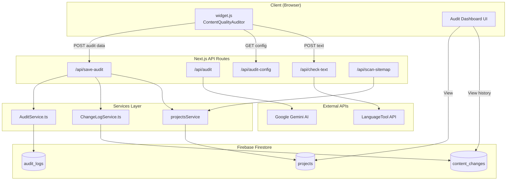
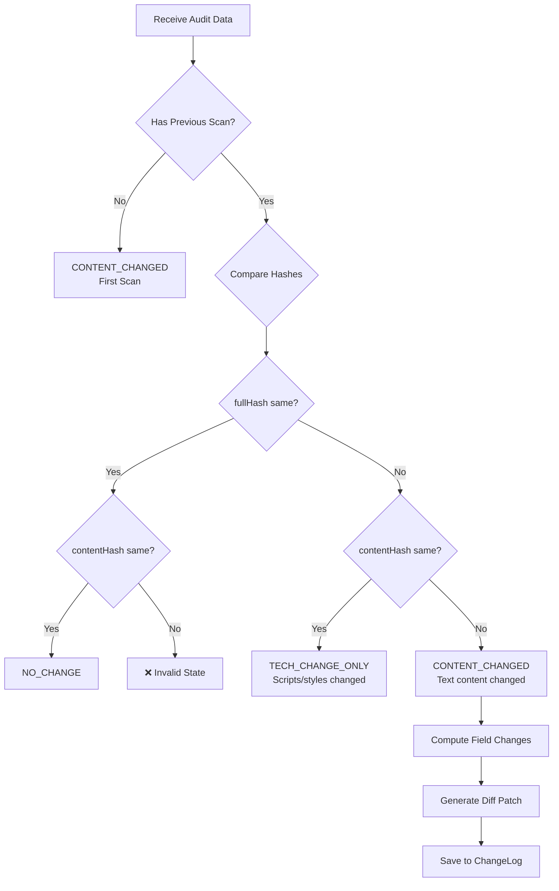

# Audit Dashboard - Deep Dive Context

> **Purpose**: Real-time content quality monitoring for web pages with automatic change detection, spell checking, SEO analysis, and deployment gating.


---

## Architecture Overview



---

## Data Flow

### 1. Widget Initialization & Audit

When `widget.js` loads on a client's website:

1. **Content Extraction** - `ContentQualityAuditor` extracts:
   - Main content text (excluding nav/footer)
   - Title, H1, meta description
   - Images, links, sections
   - Word count, readability metrics

2. **Hash Computation** - Two SHA-256 hashes:
   - `fullHash`: Entire page source (detects ANY change)
   - `contentHash`: Main content only (detects TEXT changes)

3. **5-Category Scoring** - Computed client-side:

| Category | What It Checks | Scoring Impact |
|----------|----------------|----------------|
| **Placeholders** | Lorem ipsum, `[placeholder]`, brackets | Blocks deployment if found |
| **Spelling** | Typos via LanguageTool API | Deducts per error |
| **Readability** | Flesch Reading Ease | 30-70 = optimal |
| **Completeness** | Title, H1, word count thresholds | Missing = penalties |
| **SEO** | Meta description, alt tags | Missing = warnings |

4. **Sync to Dashboard** - POST to `/api/save-audit` with full audit result

---

## Key Files Reference

### Widget (Client-Side)

| File | Purpose | Key Functions |
|------|---------|---------------|
| [widget.js](file:///Users/nayyarkhurshid/Desktop/Widget%20Folders/project-links-widget/public/widget.js) | Embedded script for client sites | `ContentQualityAuditor.audit()`, `initContentAudit()` |

<!-- slide -->

### API Routes

| Route | Method | Purpose |
|-------|--------|---------|
| [/api/save-audit](file:///Users/nayyarkhurshid/Desktop/Widget%20Folders/project-links-widget/src/app/api/save-audit/route.ts) | POST | **Main sync endpoint** - saves audit, computes diffs, logs changes |
| [/api/audit](file:///Users/nayyarkhurshid/Desktop/Widget%20Folders/project-links-widget/src/app/api/audit/route.ts) | POST | AI-powered content analysis via Gemini |
| [/api/check-text](file:///Users/nayyarkhurshid/Desktop/Widget%20Folders/project-links-widget/src/app/api/check-text/route.ts) | POST | Spell checking via LanguageTool (with nspell fallback) |
| [/api/audit-config](file:///Users/nayyarkhurshid/Desktop/Widget%20Folders/project-links-widget/src/app/api/audit-config/route.ts) | POST | Cost control - disables spellcheck for high-volume folders (>20 pages) |
| [/api/scan-sitemap](file:///Users/nayyarkhurshid/Desktop/Widget%20Folders/project-links-widget/src/app/api/scan-sitemap/route.ts) | POST | Auto-discovers pages from sitemap.xml |

<!-- slide -->

### Services

| Service | Collection | Purpose |
|---------|------------|---------|
| [AuditService.ts](file:///Users/nayyarkhurshid/Desktop/Widget%20Folders/project-links-widget/src/services/AuditService.ts) | `audit_logs` | Stores full HTML source + diff patches for historical comparison |
| [ChangeLogService.ts](file:///Users/nayyarkhurshid/Desktop/Widget%20Folders/project-links-widget/src/services/ChangeLogService.ts) | `content_changes` | Stores structured change entries for timeline UI |

<!-- slide -->

### UI Components

| Component | Purpose |
|-----------|---------|
| [website-audit-dashboard.tsx](file:///Users/nayyarkhurshid/Desktop/Widget%20Folders/project-links-widget/src/components/website-audit-dashboard.tsx) | Main dashboard with KPIs, filters, pages table |
| [page-details.tsx](file:///Users/nayyarkhurshid/Desktop/Widget%20Folders/project-links-widget/src/components/page-details.tsx) | Single page view with scan history, diff viewer |
| [change-log-timeline.tsx](file:///Users/nayyarkhurshid/Desktop/Widget%20Folders/project-links-widget/src/components/change-log-timeline.tsx) | Timeline of content changes with before/after values |
| [AuditDetailDialog.tsx](file:///Users/nayyarkhurshid/Desktop/Widget%20Folders/project-links-widget/src/components/projects/AuditDetailDialog.tsx) | Modal with tabbed category breakdown |

---

## Type Definitions

All types are in [types/index.ts](file:///Users/nayyarkhurshid/Desktop/Widget%20Folders/project-links-widget/src/types/index.ts):

```typescript
// Change classification
type ChangeStatus = 'NO_CHANGE' | 'TECH_CHANGE_ONLY' | 'CONTENT_CHANGED' | 'SCAN_FAILED';

// Core audit result (stored on ProjectLink.auditResult)
interface AuditResult {
  score: number;                    // 0-100 content quality score
  canDeploy: boolean;               // false if placeholders found
  fullHash?: string;                // SHA-256 of full page source
  contentHash?: string;             // SHA-256 of main content only
  changeStatus?: ChangeStatus;      // Computed from hash comparison
  lastRun: string;                  // ISO timestamp
  contentSnapshot?: ContentSnapshot; // Extracted page metadata
  fieldChanges?: FieldChange[];     // Detailed before/after changes
  diffPatch?: string;               // Unified diff of source changes
  categories: {
    placeholders: CategoryResult;
    spelling: CategoryResult;
    readability: CategoryResult;
    completeness: CategoryResult;
    seo: CategoryResult;
    technical: CategoryResult;
  };
}

// Content snapshot for tracking
interface ContentSnapshot {
  title: string;
  h1: string;
  metaDescription: string;
  wordCount: number;
  headings: string[];
}

// Extended snapshot with images/links
interface ExtendedContentSnapshot extends ContentSnapshot {
  images: ImageInfo[];
  links: LinkInfo[];
  sections: SectionInfo[];
  bodyTextHash: string;
}

// Individual field change
interface FieldChange {
  field: string;          // 'title', 'h1', 'images', 'links', etc.
  oldValue: any;
  newValue: any;
  changeType: 'added' | 'removed' | 'modified';
}

// Change log entry (stored in content_changes collection)
interface ChangeLogEntry {
  id: string;
  projectId: string;
  linkId: string;
  url: string;
  timestamp: string;
  changeType: 'FIRST_SCAN' | 'CONTENT_CHANGED' | 'TECH_CHANGE_ONLY';
  fieldChanges: FieldChange[];
  summary: string;           // Human-readable summary
  contentSnapshot: ExtendedContentSnapshot;
  fullHash: string;
  contentHash: string;
  auditScore?: number;
}
```

---

## Change Detection Logic

The `/api/save-audit` route implements smart change detection:



### Field Change Detection

When `CONTENT_CHANGED` is detected, the system compares snapshots:

| Field | Detection Logic |
|-------|-----------------|
| `title` | Direct string comparison |
| `h1` | Direct string comparison |
| `metaDescription` | Direct string comparison |
| `wordCount` | >5% change OR >50 words difference |
| `headings` | JSON stringify comparison |
| `images` | Set comparison of `src` attributes |
| `links` | Set comparison of `href` attributes |
| `bodyText` | Fallback if hash changed but no specific fields |

---

## Firestore Collections

### `projects` (existing)

```json
{
  "id": "project-id",
  "name": "Cosmos",
  "links": [
    {
      "id": "link-id",
      "url": "https://example.com/page",
      "title": "Page Title",
      "source": "auto",
      "auditResult": { /* AuditResult object */ }
    }
  ]
}
```

### `audit_logs` (full source storage)

```json
{
  "projectId": "project-id",
  "linkId": "link-id",
  "url": "https://example.com/page",
  "timestamp": "2026-01-01T12:00:00Z",
  "fullHash": "sha256...",
  "contentHash": "sha256...",
  "htmlSource": "<!DOCTYPE html>...",
  "diffPatch": "--- Previous Version\n+++ Current Version\n..."
}
```

> [!IMPORTANT]
> The `audit_logs` collection stores FULL HTML source for diff computation. This can be large - consider implementing cleanup/TTL policies.

### `content_changes` (structured change log)

```json
{
  "id": "entry-id",
  "projectId": "project-id",
  "linkId": "link-id",
  "url": "https://example.com/page",
  "timestamp": "2026-01-01T12:00:00Z",
  "changeType": "CONTENT_CHANGED",
  "fieldChanges": [
    { "field": "title", "oldValue": "Old", "newValue": "New", "changeType": "modified" }
  ],
  "summary": "Title modified, Word count +20",
  "contentSnapshot": { /* ExtendedContentSnapshot */ },
  "auditScore": 85
}
```

---

## Cost Control: High-Volume Folder Detection

The `/api/audit-config` endpoint implements smart cost control:

```typescript
// If a URL folder has >20 pages, disable spellcheck for that folder
const THRESHOLD = 20;

// Example: /blogs/* has 100 pages
// → enableSpellcheck: false for all /blogs/* URLs
// → Saves LanguageTool API calls
```

This prevents excessive API costs on CMS-heavy sections like `/blogs/*` or `/products/*`.

---

## UI State Management

### Dashboard States

| State | Description | Visual |
|-------|-------------|--------|
| **No change** | Hashes identical | Green badge |
| **Content changed** | Text content modified | Orange badge |
| **Tech-only change** | Scripts/styles changed, text same | Blue badge |
| **Blocked** | Placeholders detected | Red badge |
| **Scan failed** | Error during audit | Gray badge |
| **Pending** | Never scanned | Gray badge |

### Filtering & Sorting

Filter options:
- All statuses
- By specific status
- "Show only changed" toggle

Sort options:
- Most recently scanned (default)
- Lowest score first
- Critical issues first (Blocked pages)

---

## Integration Points

### Sitemap Scanner

The "Scan Sitemap" feature auto-discovers pages:

1. User provides sitemap URL (e.g., `https://example.com/sitemap.xml`)
2. API parses `<loc>` tags from XML
3. **Multilingual Support**: For sitemaps with `<xhtml:link hreflang>` tags, the parser:
   - Detects the locale of each URL by matching it against hreflang entries
   - Falls back to path-based detection (e.g., `/es-mx/` → `es-mx`)
   - Stores the locale on each `ProjectLink`
4. **Sitemap as Source of Truth**: When re-scanning:
   - Auto-discovered links NOT in the new sitemap are removed
   - Associated audit history (`audit_logs`, `content_changes`) is deleted
   - Manual links are never touched
5. Widget scans these pages on next visit

### Locale Filtering

The dashboard supports filtering by locale:
- Locale dropdown appears when pages have locales detected
- Filter options: "All locales", "No locale", or specific locales (e.g., "EN", "ES-MX")
- Locale badge displayed on each page row

### CMS Page Type Detection

The sitemap scanner includes a **post-scan review workflow** for selecting CMS vs Static page patterns:

1. **Post-Scan Review Dialog**: After scanning a sitemap:
   - A dialog appears showing all detected path patterns (e.g., `/blog/*`, `/features/*`)
   - Each pattern shows page count and example URLs
   - Patterns are pre-selected based on heuristics (nested paths = likely CMS)
   - Users can **check/uncheck** patterns to classify as CMS or Static
   - Selections are saved as **Page Type Rules**

2. **Page Type Rules**: User-defined pattern → type mappings:
   - Stored at project level (`pageTypeRules` field)
   - Checked in priority order during scans
   - Can be managed anytime via "Page Type Rules" button in dashboard
   - Patterns support wildcards: `/blog/*` matches all blog posts

3. **Automatic Detection** (when Webflow configured):
   - Fetches pages from Webflow API during sitemap scan
   - Uses `collectionId` to identify CMS template pages
   - More accurate than path-based heuristics

4. **Fallback Detection** (when no Webflow or rules):
   - Uses path-based heuristics (nested paths > 1 non-locale segment = CMS)
   - Filters out locale segments from path analysis (e.g., `/es-mx/` = static)

5. **Type Filtering**: Dashboard includes a Type filter dropdown:
   - "All types" - Show all pages
   - "Static" - Only static pages
   - "CMS" - Only collection pages


### Widget Embed

Client websites embed `widget.js`:

```html
<script src="https://app.activeset.co/widget.js" 
        data-project-id="YOUR_PROJECT_ID">
</script>
```

The widget:
1. Checks if current URL belongs to an `@activeset.co` user (or authorized domain)
2. Runs `ContentQualityAuditor.audit()`
3. Syncs results to `/api/save-audit`
4. Optionally highlights typos on page

---

## Common Extension Points

> [!TIP]
> When extending the Audit Dashboard, focus on these files:

| Task | Primary Files |
|------|---------------|
| Add new audit category | [widget.js](file:///Users/nayyarkhurshid/Desktop/Widget%20Folders/project-links-widget/public/widget.js#L45-L666) → `ContentQualityAuditor`, [types/index.ts](file:///Users/nayyarkhurshid/Desktop/Widget%20Folders/project-links-widget/src/types/index.ts#L38-L72) → `AuditResult.categories` |
| Add new field to track | [save-audit/route.ts](file:///Users/nayyarkhurshid/Desktop/Widget%20Folders/project-links-widget/src/app/api/save-audit/route.ts#L56-L191) → `computeFieldChanges()` |
| Modify dashboard UI | [website-audit-dashboard.tsx](file:///Users/nayyarkhurshid/Desktop/Widget%20Folders/project-links-widget/src/components/website-audit-dashboard.tsx) |
| Modify page details | [page-details.tsx](file:///Users/nayyarkhurshid/Desktop/Widget%20Folders/project-links-widget/src/components/page-details.tsx) |
| Modify change timeline | [change-log-timeline.tsx](file:///Users/nayyarkhurshid/Desktop/Widget%20Folders/project-links-widget/src/components/change-log-timeline.tsx) |

---

## Known Limitations

> [!WARNING]
> Current limitations to be aware of:

1. **No Firestore indexes** - Queries use in-memory sorting to avoid index requirements (see `orderBy` comments in services)
2. **Full source storage** - `audit_logs` grows large; no automatic cleanup
3. **Rate limiting** - LanguageTool public API has limits; can self-host for production
4. **Single locale** - Only `en-US` spell checking currently supported
5. **No scheduled scans** - Relies on widget visits; no cron-based re-auditing

---

## Environment Variables

```bash
# Required for AI analysis
GEMINI_API_KEY=your-gemini-api-key

# Optional: Self-hosted LanguageTool
LANGUAGETOOL_URL=https://your-lt-server.com/v2

# Firebase (required)
NEXT_PUBLIC_FIREBASE_API_KEY=...
NEXT_PUBLIC_FIREBASE_AUTH_DOMAIN=...
NEXT_PUBLIC_FIREBASE_PROJECT_ID=...
```

---

## Related Features

- **Webflow Pages**: [webflow-pages.md](file:///Users/nayyarkhurshid/Desktop/Widget%20Folders/project-links-widget/docs/features/webflow-pages.md) - SEO editing for Webflow-hosted sites
- **Link Management**: Manual link CRUD with drag-and-drop reordering
- **Proposal Generator**: AI-powered proposal creation
