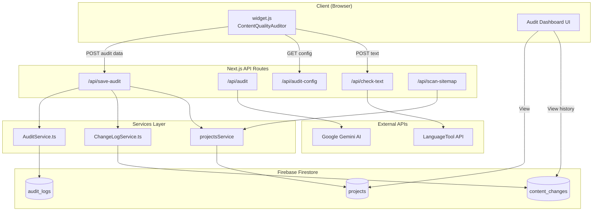
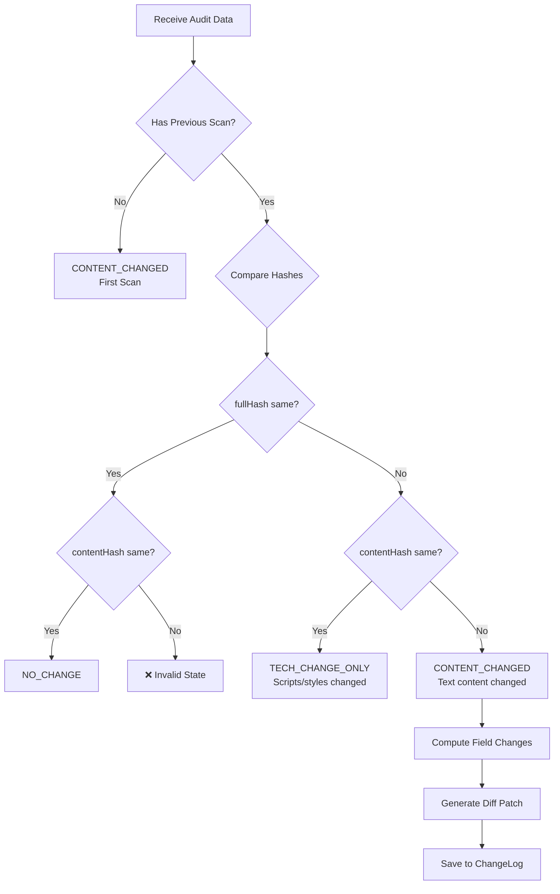

# Audit Dashboard - Deep Dive Context

> **Purpose**: Real-time content quality monitoring for web pages with automatic change detection, spell checking, SEO analysis, and deployment gating.


---

## Architecture Overview



---

## Data Flow

### 1. Widget Initialization & Audit

When `widget.js` loads on a client's website:

1. **Content Extraction** - `ContentQualityAuditor` extracts:
   - Main content text (excluding nav/footer)
   - Title, H1, meta description
   - Images, links, sections
   - Word count, readability metrics

2. **Hash Computation** - Two SHA-256 hashes:
   - `fullHash`: Entire page source (detects ANY change)
   - `contentHash`: Main content only (detects TEXT changes)

3. **5-Category Scoring** - Computed client-side:

| Category | What It Checks | Scoring Impact |
|----------|----------------|----------------|
| **Placeholders** | Lorem ipsum, `[placeholder]`, brackets | Blocks deployment if found |
| **Spelling** | Typos via LanguageTool API | Deducts per error |
| **Readability** | Flesch Reading Ease | 30-70 = optimal |
| **Completeness** | Title, H1, word count thresholds | Missing = penalties |
| **SEO** | Meta description, alt tags | Missing = warnings |

4. **Sync to Dashboard** - POST to `/api/save-audit` with full audit result

---

## Key Files Reference

### Widget (Client-Side)

| File | Purpose | Key Functions |
|------|---------|---------------|
| [widget.js](file:///Users/nayyarkhurshid/Desktop/Widget%20Folders/project-links-widget/public/widget.js) | Embedded script for client sites | `ContentQualityAuditor.audit()`, `initContentAudit()` |

<!-- slide -->

### API Routes

| Route | Method | Purpose |
|-------|--------|---------|
| [/api/save-audit](file:///Users/nayyarkhurshid/Desktop/Widget%20Folders/project-links-widget/src/app/api/save-audit/route.ts) | POST | **Main sync endpoint** - saves audit, computes diffs, logs changes |
| [/api/scan-pages](file:///Users/nayyarkhurshid/Desktop/Widget%20Folders/project-links-widget/src/app/api/scan-pages/route.ts) | POST | Server-side page scan with field change detection |
| [/api/scan-bulk](file:///Users/nayyarkhurshid/Desktop/Widget%20Folders/project-links-widget/src/app/api/scan-bulk/route.ts) | POST | Bulk page scanning for multiple URLs |
| [/api/scan-bulk/status](file:///Users/nayyarkhurshid/Desktop/Widget%20Folders/project-links-widget/src/app/api/scan-bulk/status/route.ts) | GET | Poll bulk scan progress |
| [/api/scan-bulk/running](file:///Users/nayyarkhurshid/Desktop/Widget%20Folders/project-links-widget/src/app/api/scan-bulk/running/route.ts) | GET | Check for running scans (resume detection) |
| [/api/scan-bulk/cancel](file:///Users/nayyarkhurshid/Desktop/Widget%20Folders/project-links-widget/src/app/api/scan-bulk/cancel/route.ts) | POST | Cancel an in-progress bulk scan |
| [/api/audit](file:///Users/nayyarkhurshid/Desktop/Widget%20Folders/project-links-widget/src/app/api/audit/route.ts) | POST | AI-powered content analysis via Gemini |
| [/api/check-text](file:///Users/nayyarkhurshid/Desktop/Widget%20Folders/project-links-widget/src/app/api/check-text/route.ts) | POST | Spell checking via LanguageTool (with nspell fallback) |
| [/api/audit-config](file:///Users/nayyarkhurshid/Desktop/Widget%20Folders/project-links-widget/src/app/api/audit-config/route.ts) | POST | Cost control - disables spellcheck for high-volume folders (>20 pages) |
| [/api/scan-sitemap](file:///Users/nayyarkhurshid/Desktop/Widget%20Folders/project-links-widget/src/app/api/scan-sitemap/route.ts) | POST | Auto-discovers pages from sitemap.xml |
| [/api/capture-screenshot](file:///Users/nayyarkhurshid/Desktop/Widget%20Folders/project-links-widget/src/app/api/capture-screenshot/route.ts) | POST | Manual on-demand screenshot capture |
| [/api/compare-screenshots](file:///Users/nayyarkhurshid/Desktop/Widget%20Folders/project-links-widget/src/app/api/compare-screenshots/route.ts) | POST | Server-side image diff using pixelmatch |
| [/api/audit-logs/previous](file:///Users/nayyarkhurshid/Desktop/Widget%20Folders/project-links-widget/src/app/api/audit-logs/previous/route.ts) | GET | Fetches current + previous HTML versions for comparison |
| [/api/proxy-image](file:///Users/nayyarkhurshid/Desktop/Widget%20Folders/project-links-widget/src/app/api/proxy-image/route.ts) | GET | Proxies external images to avoid CORS issues |

<!-- slide -->

### Services

| Service | Collection | Purpose |
|---------|------------|---------|
| [AuditService.ts](file:///Users/nayyarkhurshid/Desktop/Widget%20Folders/project-links-widget/src/services/AuditService.ts) | `audit_logs` | Stores full HTML source + diff patches for historical comparison |
| [ChangeLogService.ts](file:///Users/nayyarkhurshid/Desktop/Widget%20Folders/project-links-widget/src/services/ChangeLogService.ts) | `content_changes` | Stores structured change entries for timeline UI |

<!-- slide -->

### UI Components

| Component | Purpose |
|-----------|---------|
| [website-audit-dashboard.tsx](file:///Users/nayyarkhurshid/Desktop/Widget%20Folders/project-links-widget/src/components/website-audit-dashboard.tsx) | Main dashboard with KPIs, filters, hierarchical page table |
| [page-details.tsx](file:///Users/nayyarkhurshid/Desktop/Widget%20Folders/project-links-widget/src/components/page-details.tsx) | Single page view with scan history, visual QA, diff viewer |
| [change-log-timeline.tsx](file:///Users/nayyarkhurshid/Desktop/Widget%20Folders/project-links-widget/src/components/change-log-timeline.tsx) | Timeline of content changes with collapsible cards |
| [AuditDetailDialog.tsx](file:///Users/nayyarkhurshid/Desktop/Widget%20Folders/project-links-widget/src/components/projects/AuditDetailDialog.tsx) | Modal with tabbed category breakdown |
| [scan-sitemap-dialog.tsx](file:///Users/nayyarkhurshid/Desktop/Widget%20Folders/project-links-widget/src/components/scan-sitemap-dialog.tsx) | Dialog for scanning sitemaps and discovering pages |
| [social-card-preview.tsx](file:///Users/nayyarkhurshid/Desktop/Widget%20Folders/project-links-widget/src/components/social-card-preview.tsx) | Facebook/Twitter/LinkedIn social card mockups |
| [screenshot-diff.tsx](file:///Users/nayyarkhurshid/Desktop/Widget%20Folders/project-links-widget/src/components/screenshot-diff.tsx) | Visual screenshot comparison with diff overlay |
| [html-preview.tsx](file:///Users/nayyarkhurshid/Desktop/Widget%20Folders/project-links-widget/src/components/html-preview.tsx) | Sandboxed iframe HTML previews (current/previous) |
| [change-diff-viewer.tsx](file:///Users/nayyarkhurshid/Desktop/Widget%20Folders/project-links-widget/src/components/change-diff-viewer.tsx) | Field-by-field change display with inline diffs |

### Hierarchical Page Grouping

Pages are displayed in a collapsible tree structure:

```
📍 English (96)
  └─ 📊 CMS Pages (64)
       └─ 📁 /blog/* (40)
            └─ Page: Blog Post Title
       └─ 📁 /jobs/* (14)
  └─ 📄 Static Pages (32)
       └─ 📁 Root Pages (2)
       └─ 📁 /about/* (5)

📍 German (95)
  └─ 📊 CMS Pages (...)
  └─ 📄 Static Pages (...)
```

**Grouping Levels:**
1. **Locale** - Groups pages by detected language (shown when multiple locales exist)
2. **Type** - Groups by CMS or Static folder classification
3. **Folder** - Groups by URL path folder (e.g., `/blog/*`)
4. **Page** - Individual page rows

Each level is collapsible and shows a count badge.

---

## Type Definitions

All types are in [types/index.ts](file:///Users/nayyarkhurshid/Desktop/Widget%20Folders/project-links-widget/src/types/index.ts):

```typescript
// Change classification
type ChangeStatus = 'NO_CHANGE' | 'TECH_CHANGE_ONLY' | 'CONTENT_CHANGED' | 'SCAN_FAILED';

// Core audit result (stored on ProjectLink.auditResult)
interface AuditResult {
  score: number;                    // 0-100 content quality score
  canDeploy: boolean;               // false if placeholders found
  fullHash?: string;                // SHA-256 of full page source
  contentHash?: string;             // SHA-256 of main content only
  changeStatus?: ChangeStatus;      // Computed from hash comparison
  lastRun: string;                  // ISO timestamp
  contentSnapshot?: ContentSnapshot; // Extracted page metadata
  fieldChanges?: FieldChange[];     // Detailed before/after changes
  diffSummary?: string;             // Human-readable summary (e.g., "Title updated, +20 words")
  diffPatch?: string;               // Unified diff of source changes
  screenshot?: string;              // Base64 PNG screenshot of the page
  previousScreenshot?: string;      // Base64 PNG of previous scan (for comparison)
  screenshotCapturedAt?: string;    // ISO timestamp when screenshot was taken
  categories: {
    placeholders: CategoryResult;
    spelling: CategoryResult;
    readability: CategoryResult;
    completeness: CategoryResult;
    seo: CategoryResult;
    technical: CategoryResult;
    accessibility?: AccessibilityResult; // Skip links, ARIA, form labels, link text
  };
}

// Content snapshot for tracking
interface ContentSnapshot {
  title: string;
  h1: string;
  metaDescription: string;
  wordCount: number;
  headings: string[];
}

// Extended snapshot with images/links
interface ExtendedContentSnapshot extends ContentSnapshot {
  images: ImageInfo[];
  links: LinkInfo[];
  sections: SectionInfo[];
  bodyTextHash: string;
}

// Individual field change
interface FieldChange {
  field: string;          // 'title', 'h1', 'images', 'links', etc.
  oldValue: any;
  newValue: any;
  changeType: 'added' | 'removed' | 'modified';
}

// Change log entry (stored in content_changes collection)
interface ChangeLogEntry {
  id: string;
  projectId: string;
  linkId: string;
  url: string;
  timestamp: string;
  changeType: 'FIRST_SCAN' | 'CONTENT_CHANGED' | 'TECH_CHANGE_ONLY';
  fieldChanges: FieldChange[];
  summary: string;           // Human-readable summary
  contentSnapshot: ExtendedContentSnapshot;
  fullHash: string;
  contentHash: string;
  auditScore?: number;
}
```

---

## Change Detection Logic

The `/api/save-audit` route implements smart change detection:



### Field Change Detection

When `CONTENT_CHANGED` is detected, the system compares snapshots:

| Field | Detection Logic |
|-------|-----------------|
| `title` | Direct string comparison |
| `h1` | Direct string comparison |
| `metaDescription` | Direct string comparison |
| `wordCount` | >5% change OR >50 words difference |
| `headings` | JSON stringify comparison |
| `images` | Set comparison of `src` attributes |
| `links` | Set comparison of `href` attributes |
| `bodyText` | Fallback if hash changed but no specific fields |

---

## Firestore Collections

### `projects` (existing)

```json
{
  "id": "project-id",
  "name": "Cosmos",
  "links": [
    {
      "id": "link-id",
      "url": "https://example.com/page",
      "title": "Page Title",
      "source": "auto",
      "auditResult": { /* AuditResult object */ }
    }
  ]
}
```

### `audit_logs` (full source storage)

```json
{
  "projectId": "project-id",
  "linkId": "link-id",
  "url": "https://example.com/page",
  "timestamp": "2026-01-01T12:00:00Z",
  "fullHash": "sha256...",
  "contentHash": "sha256...",
  "htmlSource": "<!DOCTYPE html>...",
  "diffPatch": "--- Previous Version\n+++ Current Version\n..."
}
```

> [!IMPORTANT]
> The `audit_logs` collection stores FULL HTML source for diff computation. This can be large - consider implementing cleanup/TTL policies.

### `content_changes` (structured change log)

```json
{
  "id": "entry-id",
  "projectId": "project-id",
  "linkId": "link-id",
  "url": "https://example.com/page",
  "timestamp": "2026-01-01T12:00:00Z",
  "changeType": "CONTENT_CHANGED",
  "fieldChanges": [
    { "field": "title", "oldValue": "Old", "newValue": "New", "changeType": "modified" }
  ],
  "summary": "Title modified, Word count +20",
  "contentSnapshot": { /* ExtendedContentSnapshot */ },
  "auditScore": 85
}
```

---

## Cost Control: High-Volume Folder Detection

The `/api/audit-config` endpoint implements smart cost control:

```typescript
// If a URL folder has >20 pages, disable spellcheck for that folder
const THRESHOLD = 20;

// Example: /blogs/* has 100 pages
// → enableSpellcheck: false for all /blogs/* URLs
// → Saves LanguageTool API calls
```

This prevents excessive API costs on CMS-heavy sections like `/blogs/*` or `/products/*`.

---

## UI State Management

### Dashboard States

| State | Description | Visual |
|-------|-------------|--------|
| **No change** | Hashes identical | Green badge |
| **Content changed** | Text content modified | Orange badge |
| **Tech-only change** | Scripts/styles changed, text same | Blue badge |
| **Blocked** | Placeholders detected | Red badge |
| **Scan failed** | Error during audit | Gray badge |
| **Pending** | Never scanned | Gray badge |
| **Scanning...** | Currently being scanned | Blue badge with pulse animation |
| **Queued** | Waiting to be scanned (bulk scan) | Gray badge |

### Bulk Scan Real-Time Status

During a bulk scan, each page displays its real-time status:

```
Page 1: No change       ← Already scanned, shows actual result
Page 2: Content changed ← Already scanned, shows actual result  
Page 3: Scanning...     ← Currently being scanned (pulsing)
Page 4: Queued          ← Waiting in queue
Page 5: Queued          ← Waiting in queue
```

**Status Logic During Bulk Scan:**

| Condition | Status Displayed |
|-----------|------------------|
| Page is the current URL being scanned | **Scanning...** (blue, pulsing) |
| Page was scanned after bulk scan started | **Actual status** (No change, Changed, etc.) |
| Page has not been scanned yet in this run | **Queued** (gray) |

**Implementation Details:**

The dashboard tracks `startedAt` timestamp when a bulk scan begins. For each page, it compares:
- `bulkScanProgress.currentUrl` — Is this the page currently being scanned?
- `audit.lastRun` vs `bulkScanProgress.startedAt` — Was this page scanned after the bulk scan started?

```typescript
if (isBulkScanning) {
  const isCurrentPage = bulkScanProgress.currentUrl === link.url;
  const wasScannedInThisRun = scanStarted && pageLastRun && 
    new Date(pageLastRun).getTime() >= new Date(scanStarted).getTime();
  
  if (isCurrentPage) {
    displayStatus = "Scanning...";
  } else if (wasScannedInThisRun) {
    // Show actual status from audit result
  } else {
    displayStatus = "Queued";
  }
}
```

**Bulk Scan Progress State:**

```typescript
interface BulkScanProgress {
  current: number;      // Pages scanned so far
  total: number;        // Total pages to scan
  percentage: number;   // Completion percentage
  currentUrl: string;   // URL currently being scanned
  scanId: string;       // Unique scan identifier
  startedAt: string;    // ISO timestamp when scan started
}
```

### Compact Toolbar

The dashboard features a compact, icon-based toolbar for efficient navigation:

| Control | Icon | Purpose |
|---------|------|---------|
| **Search** | 🔍 | Filter pages by URL or title |
| **Status Filter** | ⚙ | Filter by scan status (Changed, No change, etc.) |
| **Locale Filter** | 🌐 | Filter by language/locale (shown when multiple locales exist) |
| **Type Filter** | 💾 | Filter by folder type (CMS or Static) |
| **Collapse/Expand** | ⇅ | Toggle collapse/expand all page groups |
| **Edit Folder Types** | ✏ | Enter edit mode for bulk folder classification |
| **Scan All** | ▶ | Trigger bulk scan of all pages |
| **Stop Scan** | ⏹ | Stop an in-progress bulk scan |

### Active Filters Display

When filters are applied, a row appears below the toolbar showing active filters:

```
Filters: [Search: "term" ×] [Status: Changed ×] [Type: CMS ×]  Clear all
```

- Each filter displays as a badge with an **×** button to clear individually
- **"Clear all"** link resets all filters at once
- Row only appears when at least one filter is active

### Collapse/Expand All

- **Collapse All**: Hides all nested groups (locales → types → folders → pages)
- **Expand All**: Shows all nested content
- Single toggle button switches between states
- Useful for getting a quick overview vs. detailed inspection

### Sorting Options

- Most recently scanned (default)
- Lowest score first
- Critical issues first (Blocked pages)

### Bulk Scan Controls

The dashboard includes controls for managing bulk scans:

| Control | Description |
|---------|-------------|
| **Start Scan** | Initiates a bulk scan of all pages (or selected scope) |
| **Stop Scan** | Gracefully cancels an in-progress scan, saving partial results |
| **Progress Bar** | Shows completion percentage and current URL |
| **Resume Detection** | Automatically detects and resumes running scans after page refresh |

**Scan Lifecycle:**

```
[Start] → scanning → [Stop] → cancelled
                   ↘ completed ↙
```

**Related API Endpoints:**

| Endpoint | Method | Purpose |
|----------|--------|---------|
| `/api/scan-bulk` | POST | Start a bulk scan |
| `/api/scan-bulk/status` | GET | Poll scan progress |
| `/api/scan-bulk/running` | GET | Check for running scans (resume detection) |
| `/api/scan-bulk/cancel` | POST | Request scan cancellation |

**Scan Progress Persistence:**

The scan progress store uses `globalThis` in development to persist across Next.js hot reloads. When a user refreshes the page during a scan:

1. Dashboard calls `/api/scan-bulk/running?projectId=...` on mount
2. If an active scan is found, it resumes displaying progress
3. Polling continues until scan completes or is cancelled

---

## Integration Points

### Sitemap Scanner

The "Scan Sitemap" feature auto-discovers pages:

1. User provides sitemap URL (e.g., `https://example.com/sitemap.xml`)
2. API parses `<loc>` tags from XML
3. **Multilingual Support**: For sitemaps with `<xhtml:link hreflang>` tags, the parser:
   - Detects the locale of each URL by matching it against hreflang entries
   - Falls back to path-based detection (e.g., `/es-mx/` → `es-mx`)
   - Stores the locale on each `ProjectLink`
4. **Sitemap as Source of Truth**: When re-scanning:
   - Auto-discovered links NOT in the new sitemap are removed
   - Associated audit history (`audit_logs`, `content_changes`) is deleted
   - Manual links are never touched
5. Widget scans these pages on next visit

### Locale Filtering

The dashboard supports filtering by locale:
- Locale dropdown appears when pages have locales detected
- Filter options: "All locales", "No locale", or specific locales (e.g., "EN", "ES-MX")
- Locale badge displayed on each page row

### Folder Type Classification (CMS vs Static)

The dashboard supports classifying folders as **CMS** (collection pages) or **Static**:

#### Edit Mode Workflow

1. **Enter Edit Mode**: Click the pencil (✏) icon in the toolbar
2. **Toggle Folder Types**: Each folder row shows a toggle button:
   - "Switch to CMS" - marks folder as CMS-generated content
   - "Switch to Static" - marks folder as static pages
3. **Pending Changes**: Modified folders are highlighted with a blue ring
4. **Save/Cancel**: 
   - Click ✓ (check) to save all changes
   - Click ✕ to discard pending changes
   - Badge shows count of pending changes

#### Folder Grouping

Pages are automatically grouped by their folder classification:
- **CMS Pages** group (📊 icon) - folders marked as CMS
- **Static Pages** group (📄 icon) - folders marked as Static or unclassified

#### Type Filtering

Dashboard includes a Type filter (💾 icon):
- "All types" - Show all pages
- "Static" - Only pages in Static folders
- "CMS" - Only pages in CMS folders

#### Data Storage

Folder classifications are stored as a simple mapping:

```typescript
type FolderPageTypes = Record<string, 'static' | 'collection'>;

// Example:
{
  "/blog/*": "collection",
  "/jobs/*": "collection", 
  "/about/*": "static"
}
```

- Stored at project level (`folderPageTypes` field)
- Also persisted to localStorage for offline access
- Unclassified folders default to "static" behavior


### Widget Embed

Client websites embed `widget.js`:

```html
<script src="https://app.activeset.co/widget.js" 
        data-project-id="YOUR_PROJECT_ID">
</script>
```

The widget:
1. Checks if current URL belongs to an `@activeset.co` user (or authorized domain)
2. Runs `ContentQualityAuditor.audit()`
3. Syncs results to `/api/save-audit`
4. Optionally highlights typos on page

---

## Common Extension Points

> [!TIP]
> When extending the Audit Dashboard, focus on these files:

| Task | Primary Files |
|------|---------------|
| Add new audit category | [widget.js](file:///Users/nayyarkhurshid/Desktop/Widget%20Folders/project-links-widget/public/widget.js#L45-L666) → `ContentQualityAuditor`, [types/index.ts](file:///Users/nayyarkhurshid/Desktop/Widget%20Folders/project-links-widget/src/types/index.ts#L38-L72) → `AuditResult.categories` |
| Add new field to track | [save-audit/route.ts](file:///Users/nayyarkhurshid/Desktop/Widget%20Folders/project-links-widget/src/app/api/save-audit/route.ts#L56-L191) → `computeFieldChanges()` |
| Modify dashboard UI | [website-audit-dashboard.tsx](file:///Users/nayyarkhurshid/Desktop/Widget%20Folders/project-links-widget/src/components/website-audit-dashboard.tsx) |
| Modify page details | [page-details.tsx](file:///Users/nayyarkhurshid/Desktop/Widget%20Folders/project-links-widget/src/components/page-details.tsx) |
| Modify change timeline | [change-log-timeline.tsx](file:///Users/nayyarkhurshid/Desktop/Widget%20Folders/project-links-widget/src/components/change-log-timeline.tsx) |

---

## Visual QA & Change Detection

The page details view (`page-details.tsx`) includes comprehensive visual QA features beyond basic content checking.

### Schema Markup Validation

Displays structured data (JSON-LD) found on the page:

| Feature | Description |
|---------|-------------|
| **Raw Schema Display** | Expandable view of all JSON-LD schemas on the page |
| **Type Detection** | Shows schema types (e.g., `Organization`, `Product`, `Article`) |
| **Google Rich Results Test** | Direct link to test schemas in Google's tool |

### Open Graph & Social Card Previews

Live mockups of how the page appears when shared on social media:

| Platform | Preview Shows |
|----------|---------------|
| **Facebook** | Title, description, image, site name |
| **Twitter/X** | Card format with title, description, image |
| **LinkedIn** | Professional card layout |

Images are proxied through `/api/proxy-image` to avoid CORS issues.

### Accessibility Checks

Automated accessibility validation:

| Check | What It Detects |
|-------|-----------------|
| **Skip Link** | Presence of skip navigation link |
| **ARIA Landmarks** | `main`, `nav`, `banner`, `contentinfo` regions |
| **Form Labels** | Inputs without associated `<label>` elements |
| **Link Text** | Links with generic text ("click here", "read more") |
| **Images Alt** | Images missing `alt` attributes |

### Smart Screenshot Capture

Screenshots are captured intelligently to reduce storage costs and avoid Firestore size limits:

```
First Scan → Capture screenshot (baseline)
If no existing screenshot → Capture screenshot (backfill)
If CONTENT_CHANGED → Capture screenshot
If TECH_CHANGE_ONLY or NO_CHANGE → Reuse previous screenshot
```

Screenshots are stored in Firebase Storage and referenced by URL in Firestore to stay under the 1MB document limit.

Manual capture available via "Capture Screenshot" button in the UI.
When available, the DOM Summary in the Changes tab provides a cleaner view of what was added or removed without relying on screenshots.

### Visual Comparison Modes

| Mode | Description |
|------|-------------|
| **Side by Side** | Current and previous screenshots side by side |
| **Diff Overlay** | Pixel difference highlighted in red |
| **Before/After** | Toggle between previous and current |

The diff is computed server-side via `/api/compare-screenshots` using `pixelmatch`. The endpoint accepts both base64 screenshots and Storage URLs.
Screenshots are captured as full-page images (not just the viewport).

### HTML Preview

Live preview of page HTML with version comparison:

| Tab | Content |
|-----|---------|
| **Current** | Most recent scan's HTML rendered in sandboxed iframe |
| **Previous** | Second-most-recent scan's HTML for comparison |

The `/api/audit-logs/previous` endpoint returns both versions:
- `current`: Latest audit log entry
- `previous`: Second-latest audit log entry (the actual "previous" version)
- `screenshotUrl`: Firebase Storage URL (falls back to base64 for legacy logs)

### Change Detection & Field Tracking

When content changes are detected, the system tracks specific fields:

| Field | Storage |
|-------|---------|
| `fieldChanges` | Array of `FieldChange` objects with before/after values |
| `diffSummary` | Human-readable summary (e.g., "Title updated, +20 words") |
| `sections` | DOM summary of added/removed content blocks (heading + preview) |

These are saved to `AuditResult` and displayed in the Changes tab.

### Change Log Timeline Improvements

The `change-log-timeline.tsx` component includes:

| Feature | Description |
|---------|-------------|
| **Collapsible Cards** | Click to expand/collapse change details |
| **Compact Summaries** | Shows "+44 words" instead of full body text |
| **HTML Entity Decoding** | Converts `&#x27;` to `'` for readability |
| **Field Badges** | Quick visual of which fields changed |
| **Smart Array Diffs** | Shows added/removed items for images and links |

### Responsive Preview

Captures page at multiple viewport widths via `ScreenshotService`:

| Viewport | Width |
|----------|-------|
| Mobile | 375px |
| Tablet | 768px |
| Desktop | 1280px |

### Related API Endpoints

| Endpoint | Purpose |
|----------|---------|
| `/api/scan-pages` | Triggers scan with field change detection |
| `/api/capture-screenshot` | Manual screenshot capture |
| `/api/compare-screenshots` | Server-side image diff |
| `/api/audit-logs/previous` | Fetches current + previous HTML versions |
| `/api/proxy-image` | Proxies external images for OG previews |

### Related Components

| Component | Purpose |
|-----------|---------|
| `social-card-preview.tsx` | Facebook/Twitter/LinkedIn mockups |
| `screenshot-diff.tsx` | Visual comparison UI |
| `html-preview.tsx` | Sandboxed iframe previews |
| `change-diff-viewer.tsx` | Field-by-field change display |
| `change-log-timeline.tsx` | Historical change timeline |

---

## Known Limitations

> [!WARNING]
> Current limitations to be aware of:

1. **No Firestore indexes** - Queries use in-memory sorting to avoid index requirements (see `orderBy` comments in services)
2. **Full source storage** - `audit_logs` grows large; no automatic cleanup
3. **Rate limiting** - LanguageTool public API has limits; can self-host for production
4. **Single locale** - Only `en-US` spell checking currently supported
5. **No scheduled scans** - Relies on widget visits; no cron-based re-auditing

---

## Environment Variables

```bash
# Required for AI analysis
GEMINI_API_KEY=your-gemini-api-key

# Optional: Self-hosted LanguageTool
LANGUAGETOOL_URL=https://your-lt-server.com/v2

# Firebase (required)
NEXT_PUBLIC_FIREBASE_API_KEY=...
NEXT_PUBLIC_FIREBASE_AUTH_DOMAIN=...
NEXT_PUBLIC_FIREBASE_PROJECT_ID=...
```

---

## Related Features

- **Webflow Pages**: [webflow-pages.md](file:///Users/nayyarkhurshid/Desktop/Widget%20Folders/project-links-widget/docs/features/webflow-pages.md) - SEO editing for Webflow-hosted sites
- **Link Management**: Manual link CRUD with drag-and-drop reordering
- **Proposal Generator**: AI-powered proposal creation
